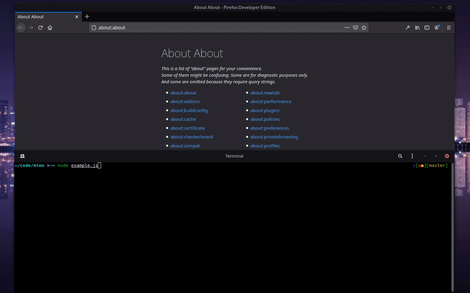

# Mimo Crawler
***Mimo is a "state of the art" web crawler that uses non-headless Firefox and js injection to crawl webpages.***



### Why Mimo?
What makes Mimo special is that instead of using DevTools Protocol and a browser in headless mode,
it uses websockets as a communication channel between a **non-headless** browser and the client.
You can interact and crawl the webpage by evaluating your javascript code into the page's context.


This way: 
* An extremely high-speed crawling is achieved
* Firewall's traceability is diminished
* Headless browser detectors can be bypassed

### Features
* Simple Client API
* Interactive crawling
* Extremely fast compared to similar tools. 
* Fully operated by your javascript code
* Web spidering
 
### Requirements
* Firefox
* [node >= 14](https://nodejs.org/en/download/)
* Xvfb (optional)

### Installation

```bash
git clone https://github.com/NikosRig/Mimo-Crawler
cd Mimo-Crawler && npm install
```

### Getting started


#### Starting with the Mimo Server
 
 You must first start the server by executing startMimo.js.
 - `--firefox` (optional) Overrides the default firefox binary path.
 
```bash
node startMimo.js 
```
You can also run Mimo on machines with no display hardware and no physical input devices
by using Xvfb. Mimo will be still using a non-headless firefox.
```bash
xvfb-run node startMimo.js 
```

Then you are ready to use the Mimo API by including mimoClient.js

#### Using the Mimo client API
   
   
##### `mimoClient.crawl(options)`
   Sends a new crawl request to Mimo.
- `options` {Object}
  - `url` {String} The url that you want to be crawled.
  - `code` {String} The javascript code that will be evaluated into the webpage.
  - `closeTabDelay` (optional) {millisecond} Overrides the tab's default closing time
  - `disableWindowAlert` (optional) {boolean} If is setted to true it disables window.alert()
    
 You can also write a script, parse it with node's `fs.readFileSync` and pass it as code's value.
```bash
   let options = { code: fs.readFileSync('./myscript.js', 'utf8'); };
 ```
   
In order to get response from Mimo your code must call the `response` method
with the value that you want to be returned as a parameter.
```bash
let mycode = `setTimeout(() => {
   //do some things
   
  response({
   pageTitle: document.title,      // Then return an object with the pagetitle and the body.
   body: document.body.innerHTML
  }); 
},2000)`;
```
 
##### `mimoClient.addResponseListener(callback)`
 Every time Mimo sends you back a response, this callback function will be called
 with the response as an argument.
 
```bash
mimoClient.addResponseListener(response => console.log(response) )
```

#### `mimoClient.close()`
Closes the connection with Mimo and terminates the client script.

#### Basic Example

```bash
const mimo_client = require('./src/app/mimoClient');

let message = {
    url: 'https://www.amazon.com/s?bbn=493964&rh=n%3A172282%2Cn%3A%21493964%2Cn%3A281407%2Cp_n_shipping_option-bin%3A3242350011&dc&fst=as%3Aoff&pf_rd_i=16225009011&pf_rd_m=ATVPDKIKX0DER&pf_rd_p=82d03e2f-30e3-48bf-a811-d3d2a6628949&pf_rd_r=MF600JK13S83FRSH3667&pf_rd_s=merchandised-search-4&pf_rd_t=101&qid=1486423355&rnid=493964&ref=s9_acss_bw_cts_AEElectr_T1_w',
    code: `
   
       let product_urls = [];
       
       document.querySelectorAll('a.a-link-normal').forEach(aElement => {
       
           product_urls.push('https://www.amazon.com' + aElement.getAttribute('href'))
       })
            
       response({category_products: product_urls})
    `
};

mimo_client.crawl(message)

mimo_client.addResponseListener((msg) => {
    console.log(msg)
    mimo_client.close();
})

```


### Web Spidering
Every request that you send to mimo creates a new tab, 
stores your attached code on the browser's storage and executes it every time you open a webpage in that tab.
For example if you reload the page or if you click on a link your code will be re-executed. 

```bash
const mimo_client = require('./src/app/mimoClient');

let spiderCode = `
   if (document.querySelector('a')) {
        // This will open a new url in that tab, and your code will be re-executed
        document.querySelector('a').click()
   }
    response(document.title)
`;

mimo_client.crawl({
    url: 'https://www.example.com',
    code: spiderCode
})

```

### Licence

Copyright (c) 2020 Nikos Rigas

This software is released under the terms of the GNU General Public License v3.0.
See the [licence](https://github.com/NikosRig/Mimo-Crawler/blob/master/LICENCE) file for further information.


